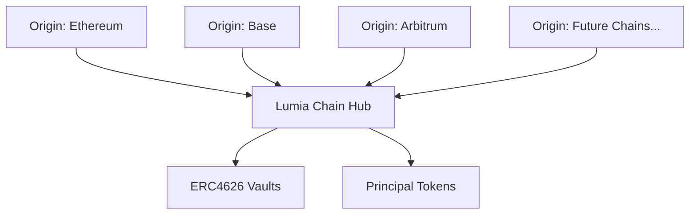
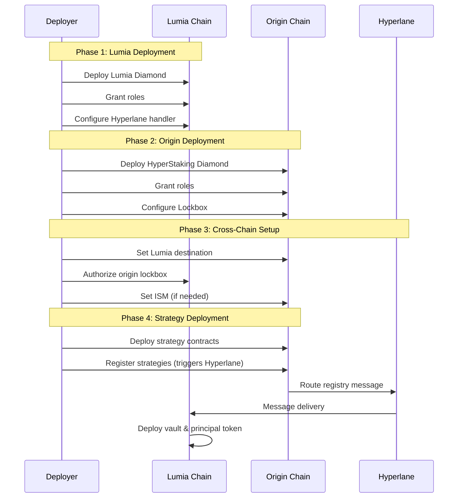
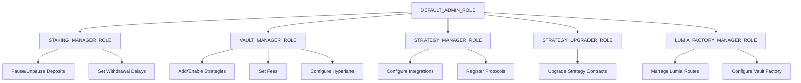

# HyperStaking Contracts - Deployment Guide

> **Note**: This guide focuses on deploying and configuring the HyperStaking protocol. For development instructions, see [DEVELOPMENT.md](./DEVELOPMENT.md).

## Table of Contents

1. [Deployment Overview](#deployment-overview)
2. [Pre-Deployment Checklist](#pre-deployment-checklist)
3. [Deployment Procedures](#deployment-procedures)
4. [Post-Deployment Configuration](#post-deployment-configuration)
5. [Test Deployment Example](#test-deployment-example)
6. [Emergency Procedures](#emergency-procedures)
7. [Appendix](#appendix)

---

## Deployment Overview

### System Architecture

HyperStaking uses a **star topology** with Lumia Chain as the central hub:



**Critical Deployment Facts:**

- **Lumia Diamond**: Deploy **once** on Lumia Chain only
- **Origin Diamonds**: Deploy **one per supported chain** (Ethereum, Base, etc.)
- **Hyperlane**: Cross-chain messaging (integrated into diamonds)
- **Strategies**: Deploy separately as upgradeable UUPS contracts

### Deployment Sequence



---

## Pre-Deployment Checklist

### 1. Environment Setup

```bash
# Clone repository
git clone <repository-url>
cd HyperStaking-contracts

# Install dependencies
npm install
git submodule update --init --recursive

# Copy environment template
cp .env.example .env
```

### 2. Environment Variables

Edit `.env` with deployment configuration:

```env
# Network RPC URLs
ETHEREUM_RPC_URL="https://..."
SEPOLIA_RPC_URL="https://..."
LUMIA_MAINNET_RPC_URL="https://mainnet-rpc.lumia.org"
LUMIA_TESTNET_RPC_URL="https://testnet-rpc.lumia.org"

# Deployer wallet
DEPLOYER_PRIVATE_KEY="0x..."

# Optional: for verification
ETHERSCAN_API_KEY="..."
```

### 3. Prepare Deployment Parameters

Create parameter files for each network in `ignition/parameters.*.json`:

**Example: `ignition/parameters.sepolia.json`**

```json
{
  "General": {
    "lockboxMailbox": "0x...",
    "lockboxDestination": 2030232745,
    "initStakingManager": "0x...",
    "initVaultManager": "0x...",
    "initStrategyManager": "0x..."
  }
}
```

**Example: `ignition/parameters.lumia-mainnet.json`**

```json
{
  "General": {
    "mailbox": "0x...",
    "owner": "0x...",
    "lumiaFactoryManager": "0x..."
  }
}
```

### 4. Gather Hyperlane Addresses

Obtain Hyperlane mailbox addresses and domain IDs from:

- [Hyperlane Documentation](https://docs.hyperlane.xyz/)
- Repository: `hyperlane/chains/<network>/addresses.yaml`

**Common Domain IDs:**

```javascript
const DOMAINS = {
  ethereum: 1,
  sepolia: 11155111,
  base: 8453,
  arbitrum: 42161,
  lumia_mainnet: 1952959480  // Example - verify actual value
};
```

---

## Deployment Procedures

### Phase 1: Lumia Chain Deployment

Deploy the central hub on Lumia Chain **once**.

#### Step 1: Deploy Lumia Diamond

```bash
# Using npm script
npm run deploy-lumia-diamond-mainnet

# Or directly with hardhat
npx hardhat ignition deploy \
  ignition/modules/LumiaDiamond.ts \
  --parameters ignition/parameters.lumia-mainnet.json \
  --network lumia_mainnet
```

**Deployed Components:**

- Diamond proxy
- Core facets: DiamondCut, DiamondLoupe, Ownership
- Lumia facets: HyperlaneHandler, RealAssets, LumiaFactory, StakeRedeemRoute
- LumiaDiamondInit (initialization)

#### Step 2: Verify Lumia Deployment

```bash
# Verify contracts on block explorer (ignition)
npx hardhat ignition verify chain-11155111  # For Sepolia
npx hardhat ignition verify chain-1         # For Ethereum mainnet

# Check initialization
npx hardhat console --network lumia_mainnet
> const diamond = await ethers.getContractAt("LumiaDiamondAcl", "LUMIA_DIAMOND_ADDRESS")
> await diamond.hasRole(await diamond.LUMIA_FACTORY_MANAGER_ROLE(), "MANAGER_ADDRESS")
// Should return: true
```

#### Step 3: Update Parameters File

After deployment, update `ignition/parameters.*.json` files on origin chains with the Lumia Diamond address:

```json
{
  "General": {
    "lockboxLumiaFactory": "0x...",  // Lumia Diamond address
    ...
  }
}
```

---

### Phase 2: Origin Chain Deployment

Deploy HyperStaking diamond on each origin chain (Ethereum, Base, Arbitrum, etc.).

#### Step 1: Deploy HyperStaking Diamond

```bash
# Using npm script (example: Sepolia testnet)
npm run deploy-hyperstaking-sepolia

# Or directly with hardhat
npx hardhat ignition deploy \
  ignition/modules/HyperStaking.ts \
  --parameters ignition/parameters.sepolia.json \
  --network sepolia
```

**Deployed Components:**

- Diamond proxy
- Core facets: DepositFacet, AllocationFacet, LockboxFacet, HyperFactoryFacet
- Integration facets: SuperformIntegration, CurveIntegration, EmaPricing
- HyperStakingInit (initialization)

#### Step 2: Verify Origin Deployment

```bash
# Verify contracts on block explorer (Ignition built-in)
npx hardhat ignition verify chain-11155111  # For Sepolia
npx hardhat ignition verify chain-1         # For Ethereum mainnet

# Check roles
npx hardhat console --network sepolia
> const diamond = await ethers.getContractAt("HyperStakingAcl", "DIAMOND_ADDRESS")
> await diamond.hasRole(await diamond.VAULT_MANAGER_ROLE(), "VAULT_MANAGER_ADDRESS")
```

---

### Phase 3: Cross-Chain Configuration

Configure Hyperlane communication between origin and Lumia chains.

#### Step 1: Configure Lockbox (Origin Chain)

Set the Lumia destination for cross-chain messages:

```bash
# Using hyper-cli
CMD=setup-lockbox npx hardhat run scripts/hyper-cli.ts --network sepolia
```

**What this does:**

- Sets `lockboxDestination` (Lumia domain ID)
- Proposes and applies `lumiaFactory` address
- Enables message routing to Lumia

**Note:** In production, there's a timelock delay between proposing and applying the Lumia factory address.

#### Step 2: Authorize Origin (Lumia Chain)

Allow Lumia to receive messages from the origin chain:

```bash
# Using hyper-cli
CMD=setup-hyperlane-handler npx hardhat run scripts/hyper-cli.ts --network lumia_beam
```

**What this does:**

- Calls `updateAuthorizedOrigin(originLockbox, true, originDomain)`
- Enables Lumia to accept messages from the origin chain

#### Step 3: Configure ISM (If Required)

On some networks (e.g., Sepolia), the default Hyperlane mailbox may block unknown messages. Deploy and set a custom ISM:

```bash
# Deploy Trusted Relayer ISM
npx hardhat ignition deploy \
  ignition/modules/test/TrustedRelayerIsm.ts \
  --parameters ignition/parameters.sepolia.json \
  --network sepolia

# Set ISM on Lockbox
CMD=set-origin-ism npx hardhat run scripts/hyper-cli.ts --network sepolia
```

#### Step 4: Configure Post Dispatch Hook (Optional)

For better relayer compatibility on some networks:

```bash
# Deploy No-Op Hook
npx hardhat ignition deploy \
  ignition/modules/test/NoOpHook.ts \
  --network sepolia

# Set hook on Lockbox
CMD=set-origin-hook npx hardhat run scripts/hyper-cli.ts --network sepolia
```

---

### Phase 4: Strategy Deployment

Deploy strategy contracts as separate UUPS upgradeable proxies.

#### Step 1: Deploy Strategy Contract

##### Example: Deploying Test Reserve Strategy

```bash
# Using npm script
npm run deploy-test-strategy-sepolia

# Or directly
npx hardhat ignition deploy \
  ignition/modules/test/MockReserveStrategy.ts \
  --parameters ignition/parameters.sepolia.json \
  --network sepolia
```

**Other available strategies:**

```bash
# Dinero Strategy (Sepolia)
npm run deploy-dinero-strategy-sepolia

# Superform Strategy (Sepolia)
npm run deploy-superform-strategy-sepolia
```

All strategies are deployed using Hardhat Ignition with the UUPS proxy pattern:

1. Implementation contract deployed
2. ERC1967Proxy deployed with initialization data
3. Proxy treated as the strategy contract

#### Step 2: Supply Strategy (For Test Strategies)

Test strategies need assets to generate yield:

```bash
# Create test yield token (if not exists)
npx hardhat ignition deploy \
  ignition/modules/test/TestERC20.ts \
  --parameters ignition/parameters.sepolia.json \
  --network sepolia

# Supply strategy with yield tokens
CMD=supply-strategy npx hardhat run scripts/hyper-cli.ts --network sepolia
```

#### Step 3: Register Strategy

Register the strategy with HyperFactory, which triggers:

1. Local registration on origin chain
2. Hyperlane message to Lumia
3. Vault and principal token deployment on Lumia

```bash
# Using hyper-cli
CMD=add-strategy npx hardhat run scripts/hyper-cli.ts --network sepolia
```

**What happens:**

- Strategy registered in `HyperFactoryFacet`
- `RouteRegistry` message sent via Hyperlane
- Lumia deploys ERC4626 vault and principal token
- Route info stored on both chains

---

## Post-Deployment Configuration

### Fee Configuration

Set fee rates and recipients for strategies:

```bash
# Using hyper-cli
CMD=set-fee-data npx hardhat run scripts/hyper-cli.ts --network sepolia
```

**Example values (configured in CLI_CONFIG):**

- Fee rate: 2% (0.02 * 1e18)
- Fee recipient: Protocol treasury address

### Strategy Integration Configuration

#### For Superform Strategies

```typescript
const superformIntegration = await ethers.getContractAt(
  "ISuperformIntegration",
  diamondAddress
);

await superformIntegration.connect(strategyManager).initializeStorage({
  superformFactory: "0x...",
  superformRouter: "0x...",
  superPositions: "0x..."
});
```

#### For Curve Strategies

```typescript
const curveIntegration = await ethers.getContractAt(
  "ICurveIntegration",
  diamondAddress
);

await curveIntegration.connect(strategyManager).setCurveRouter(curveRouterAddress);

// Register pools
await curveIntegration.connect(strategyManager).registerCurvePool(
  poolAddress,
  nCoins,
  [token0, token1, token2],
  [0, 1, 2]
);
```

---

## Test Deployment Example

This section provides a complete walkthrough of deploying HyperStaking on testnets.

### Environment: Sepolia to Lumia Beam

**Networks:**

- Origin: Sepolia (Ethereum testnet)
- Hub: Lumia Beam (Lumia testnet)

### Step-by-Step Deployment

#### 1. Deploy Lumia Diamond

```bash
npm run deploy-lumia-diamond-beam
```

**Output:**

```
Deployed LumiaDiamond at: 0x...
```

Update `ignition/parameters.sepolia.json` with Lumia Diamond address.

#### 2. Deploy HyperStaking Diamond (Sepolia)

```bash
npm run deploy-hyperstaking-sepolia
```

**Output:**
```
Deployed HyperStaking at: 0x...
```

#### 3. Configure Cross-Chain Communication

```bash
# Setup lockbox (Sepolia)
CMD=setup-lockbox npx hardhat run scripts/hyper-cli.ts --network sepolia

# Authorize origin (Lumia Beam)
CMD=setup-hyperlane-handler npx hardhat run scripts/hyper-cli.ts --network lumia_beam

# Deploy and set ISM (Sepolia - required for testnet)
npx hardhat ignition deploy \
  ignition/modules/test/TrustedRelayerIsm.ts \
  --parameters ignition/parameters.sepolia.json \
  --network sepolia

CMD=set-origin-ism npx hardhat run scripts/hyper-cli.ts --network sepolia

# Deploy and set hook (Sepolia - optional but recommended)
npx hardhat ignition deploy \
  ignition/modules/test/NoOpHook.ts \
  --network sepolia

CMD=set-origin-hook npx hardhat run scripts/hyper-cli.ts --network sepolia
```

#### 4. Deploy Test Strategy

```bash
# Deploy test yield token
npx hardhat ignition deploy \
  ignition/modules/test/TestERC20.ts \
  --parameters ignition/parameters.sepolia.json \
  --network sepolia

# Deploy reserve strategy
npm run deploy-test-strategy-sepolia

# Supply strategy with yield tokens
CMD=supply-strategy npx hardhat run scripts/hyper-cli.ts --network sepolia
```

#### 5. Register Strategy

```bash
CMD=add-strategy npx hardhat run scripts/hyper-cli.ts --network sepolia
```

**Monitor Hyperlane:**

- Watch for `Dispatch` event on Sepolia
- Track message at [Hyperlane Explorer](https://explorer.hyperlane.xyz/)
- Verify delivery on Lumia Beam (route registered, vault deployed)

#### 6. Test Stake Deposit

```bash
CMD=stake-deposit npx hardhat run scripts/hyper-cli.ts --network sepolia
```

**Expected flow:**

1. Deposit on Sepolia
2. Hyperlane message dispatched
3. Relayer delivers to Lumia
4. Vault shares minted on Lumia

**Example relayer log:**

```
Observed message 0x640f56b2... on sepolia to lumiabeam
Preparing to relay message 0x640f56b2...
Relaying message 0x640f56b2...
Pending https://beam-explorer.lumia.org/tx/0xa661daf8...
```

#### 7. Simulate Yield and Report

```bash
# Increase asset price (simulate yield)
# Note: Without yield gain, report will revert. This increases the strategy's
# asset price to create a yield that can be reported.
CMD=set-strategy-asset-price npx hardhat run scripts/hyper-cli.ts --network sepolia

# Set fee configuration
CMD=set-fee-data npx hardhat run scripts/hyper-cli.ts --network sepolia

# Check if there's revenue to report (optional but recommended)
# This calls checkRevenue() which shows stake added from yield
CMD=info npx hardhat run scripts/hyper-cli.ts --network sepolia

# Report revenue to Lumia
CMD=report-revenue npx hardhat run scripts/hyper-cli.ts --network sepolia
```

#### 8. Test Redemption

```bash
# Redeem shares on Lumia
CMD=shares-redeem npx hardhat run scripts/hyper-cli.ts --network lumia_beam

# Wait for Hyperlane message delivery to Sepolia
# Then claim withdrawal
CMD=claim-withdraw npx hardhat run scripts/hyper-cli.ts --network sepolia
```

### Verification Commands

Check deployment status:

```bash
# Origin chain info
CMD=info npx hardhat run scripts/hyper-cli.ts --network sepolia

# Lumia chain info
CMD=lumia-info npx hardhat run scripts/hyper-cli.ts --network lumia_beam

# User's failed redeems
CMD=get-user-failed-redeems npx hardhat run scripts/hyper-cli.ts --network sepolia

# User's recent claims
CMD=get-user-last-claims npx hardhat run scripts/hyper-cli.ts --network sepolia
```

---

## Emergency Procedures

### Pause Deposits

```bash
# Stop accepting new deposits
const depositFacet = await ethers.getContractAt("IDeposit", diamondAddress);
await depositFacet.connect(stakingManager).pauseDeposit();
```

### Disable Strategy

```bash
# Prevent new allocations to a strategy
const hyperFactory = await ethers.getContractAt("IHyperFactory", diamondAddress);
await hyperFactory.connect(vaultManager).setStrategyEnabled(strategyAddress, false);
```

### Update Hyperlane Mailbox

If Hyperlane mailbox is compromised or upgraded:

```bash
# 1. Propose new mailbox (VAULT_MANAGER_ROLE)
await lockboxFacet.connect(vaultManager).proposeMailbox(newMailboxAddress);

# 2. Wait for timelock delay (typically 24-48 hours)

# 3. Apply change (VAULT_MANAGER_ROLE)
await lockboxFacet.connect(vaultManager).applyMailbox();
```

### Reexecute Failed Redeem

If a redemption message fails on origin chain:

```bash
CMD=reexecute-failed-redeem npx hardhat run scripts/hyper-cli.ts --network sepolia
```

### Upgrade Facet

To upgrade a facet in the diamond:

```bash
# Edit scripts/diamondCut.ts with:
# - OLD_FACET_ADDRESS
# - FACET_CONTRACT_NAME
# - FACET_CONTRACT_INTERFACE

npx hardhat run scripts/diamondCut.ts --network sepolia
```

**Process:**

1. Script compares old vs new selectors
2. Deploys new facet contract
3. Prepares diamondCut (Add/Replace/Remove)
4. Executes upgrade via DiamondCutFacet

---

## Appendix

### Access Control Roles



**Role Assignment Best Practices:**

- `DEFAULT_ADMIN_ROLE`: Multi-sig wallet (3-of-5 recommended)
- `VAULT_MANAGER_ROLE`: Multi-sig (can be same as admin)
- `STAKING_MANAGER_ROLE`: EOA for faster response (operations team)
- `STRATEGY_MANAGER_ROLE`: Multi-sig (protocol integrations are critical)
- `STRATEGY_UPGRADER_ROLE`: Multi-sig (same as admin recommended)
- `LUMIA_FACTORY_MANAGER_ROLE`: Multi-sig (Lumia-specific)

### Hyperlane Message Types

```solidity
enum MessageType {
  RouteRegistry,  // Register new strategy route (Origin -> Lumia)
  StakeInfo,      // New stake event (Origin -> Lumia)
  StakeReward,    // Reward distribution (Origin -> Lumia)
  StakeRedeem     // Redemption request (Lumia -> Origin)
}
```

### Hyper-CLI Commands

View all available commands:

```bash
CMD=help npx hardhat run scripts/hyper-cli.ts
```

### Useful Resources

- **Hyperlane Explorer**: <https://explorer.hyperlane.xyz/>
- **Hyperlane Docs**: <https://docs.hyperlane.xyz/>
- **ERC-2535 Diamond**: <https://eips.ethereum.org/EIPS/eip-2535>
- **ERC-4626 Vaults**: <https://eips.ethereum.org/EIPS/eip-4626>
- **Hardhat Ignition**: <https://hardhat.org/ignition/>

---

Last Updated: January 2026
