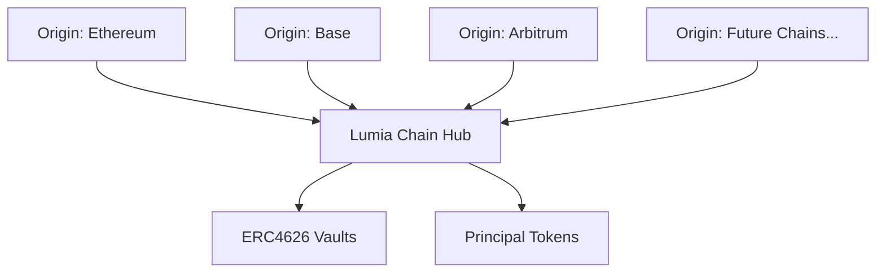
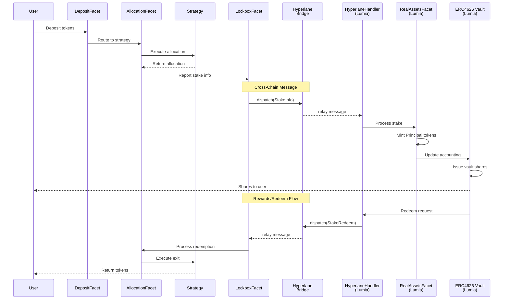

# HyperStaking Contracts - Development Guide

> **Note**: This guide focuses on developing and testing the HyperStaking protocol. For deployment instructions, see [DEPLOYMENT_GUIDE.md](./DEPLOYMENT_GUIDE.md).

## Table of Contents

1. [Project Overview](#project-overview)
2. [Architecture](#architecture)
3. [Environment Setup](#environment-setup)
4. [Testing Framework](#testing-framework)
5. [Creating Custom Strategies](#creating-custom-strategies)
6. [Development Workflow](#development-workflow)
7. [Useful Development Commands](#useful-development-commands)
8. [Additional Resources](#additional-resources)
9. [Troubleshooting](#troubleshooting)

---

## Project Overview

HyperStaking is a cross-chain staking protocol built on the Diamond Proxy (ERC-2535) pattern, enabling users to stake various tokens across multiple chains with yield-generating strategies.

### Key Features

- **Diamond Proxy Architecture**: Modular, upgradeable contract system
- **Multi-Chain Support**: Origin chains (Ethereum, Base, Arbitrum) + Lumia Chain
- **ERC4626 Vaults**: Standard-compliant yield-bearing vaults
- **Hyperlane Integration**: Cross-chain messaging infrastructure
- **Multiple Strategies**: Dinero, Superform, Curve, and custom strategies

---

## Architecture

### Star Topology: Multi-Chain Architecture

HyperStaking uses a **star architecture** with the Lumia Chain at the center:



**Key Design Principles:**

- **Single Lumia Diamond**: One central diamond deployed only on Lumia Chain
- **Multiple Origin Diamonds**: One HyperStaking diamond per supported origin chain
- **Hyperlane Bridge**: Cross-chain messaging between any origin chain and Lumia
- **Unified Accounting**: All vaults and accounting centralized on Lumia

### Diamond Proxy Pattern

The system uses two types of diamond proxies:

#### 1. Origin-Chain Diamonds (HyperStaking)

**Deployed on**: Multiple chains (Ethereum, Base, Arbitrum, etc.)

**Purpose**: Handle local deposits, allocations, and strategy execution

**Core Facets**:

- `DepositFacet`: User deposit entry point
- `AllocationFacet`: Strategy allocation management
- `LockboxFacet`: Cross-chain message coordination
- `HyperFactoryFacet`: Strategy registration
- `EmaPricingFacet`: EMA-based price anchoring for cross-chain swaps
- Integration facets (may vary by deployment)

> **Future Architecture Note**: Strategy implementations (currently in `contracts/hyperstaking/strategies/`) may be separated into a standalone repository outside the core HyperStaking codebase. This would enable:
>
> - Better scalability and independent strategy development
> - External parties to contribute strategies
> - Lumia team review process for community strategies
> - Enhanced security isolation (malicious strategies cannot affect core protocol or other strategies)

#### 2. Lumia-Chain Diamond

**Deployed on**: Lumia Chain **only**

**Purpose**: Central accounting hub for all origin chains

**Facets**:

- `HyperlaneHandlerFacet`: Receives and processes cross-chain messages
- `RealAssetsFacet`: Manages principal token minting/burning
- `LumiaFactoryFacet`: Deploys and manages ERC4626 vaults
- `StakeRedeemRouteFacet`: Handles redemption flows

### Cross-Chain Data Flow



---

## Environment Setup

### 1. Prerequisites

```bash
# Required versions
Node.js: 22.x
npm: 10.x
```

### 2. Installation

```bash
# Clone the repository
git clone git@github.com:LumiaChain/HyperStaking-contracts.git
cd HyperStaking-contracts

# Install JavaScript dependencies
npm install

# Initialize Git submodules for Solidity dependencies
git submodule update --init --recursive

# Set up environment variables
cp .env.example .env
```

### 3. Environment Variables

Edit `.env` file with your configuration:

```env
# Gas and Size Reporting
REPORT_GAS=false
REPORT_SIZE=false

# Network RPC URLs
ETHEREUM_RPC_URL=""
SEPOLIA_RPC_URL=""
HOLESKY_RPC_URL=""
BSC_TESTNET_RPC_URL=""

LUMIA_MAINNET_RPC_URL="https://mainnet-rpc.lumia.org"
LUMIA_TESTNET_RPC_URL="https://testnet-rpc.lumia.org"

LOCAL_RPC_URL="http://127.0.0.1:8545/"

# API Keys
ETHERSCAN_API_KEY=""

# Performance
HARDHAT_MAX_MEMORY=20000

# Wallet Configuration
WALLET_MNEMONIC="... your mnemonic ..."
DEPLOYER_PRIVATE_KEY="0x0000000000000000000000000000000000000000000000000000000000000000"
```

### 4. Verify Installation

```bash
# Compile contracts
npx hardhat compile

# Run linters
npm run lint
npm run check
```

---

## Testing Framework

### Test Structure

The test suite is organized into unit tests and integration tests:

```
test/
├── setup.ts          # Base deployment fixtures
├── shared.ts         # Shared test utilities
├── unit/             # Fast, isolated contract tests
└── integration/      # Tests against forked mainnets
```

All tests use Hardhat's fixture system for efficient setup and teardown.

### Base Deployment Fixture (`test/setup.ts`)

The `deployHyperStakingBase` fixture is the foundation for all tests:

```typescript
import { loadFixture } from "@nomicfoundation/hardhat-toolbox/network-helpers";
import { deployHyperStakingBase } from "./setup";

async function deployHyperStaking() {
  const {
    signers,                // Named signers with roles
    hyperStaking,           // Origin-chain diamond with all facets
    lumiaDiamond,           // Lumia-chain diamond facets
    testERC20,              // Mock ERC20 token (18 decimals)
    testWstETH,             // Mock wstETH for native yields
    testUSDC,               // Mock USDC (6 decimals)
    testUSDT,               // Mock USDT (6 decimals)
    erc4626Vault,           // Mock ERC4626 vault
    mailbox,                // Hyperlane test mailbox (single-chain)
    invariantChecker,       // Checks protocol invariants
  } = await loadFixture(deployHyperStakingBase);

  // Your test setup here...
}
```

### Available Signers and Roles

```typescript
// From test/shared.ts getSigners()
signers = {
  owner,                  // Diamond owner
  stakingManager,         // STAKING_MANAGER_ROLE
  vaultManager,           // VAULT_MANAGER_ROLE
  strategyManager,        // STRATEGY_MANAGER_ROLE
  strategyUpgrader,       // STRATEGY_UPGRADER_ROLE (same as owner)
  lumiaFactoryManager,    // LUMIA_FACTORY_MANAGER_ROLE
  bob,                    // Regular user
  alice,                  // Regular user
}
```

### Running Tests

The project includes comprehensive test suites. Check `package.json` for available test commands:

```bash
# Unit tests - Fast, isolated contract tests
npm run test:unit

# Integration tests - Tests against forked mainnets
npm run test:integration

# Run specific test file
npx hardhat test test/unit/Staking.test.ts

# Generate gas reports
REPORT_GAS=true npx hardhat test

# Coverage analysis
npm run coverage
```

> **Note**: Integration tests may require additional environment configuration (RPC URLs, etc.)

### Writing Tests

**Key testing patterns to follow:**

- Use `loadFixture` from Hardhat for efficient test setup
- Leverage `test/setup.ts` base fixtures (`deployHyperStakingBase`)
- Check protocol invariants with `afterEach` hooks
- Register strategies with `HyperFactoryFacet` in test setup
- Use `test/shared.ts` utilities for common operations

Refer to existing tests for implementation patterns.

---

## Creating Custom Strategies

### Strategy Interface

All strategies must implement `IStrategy`:

```solidity
interface IStrategy {
    // Asynchronous allocation
    function requestAllocation(uint256 amount, address receiver)
        external returns (uint256 id);
    function claimAllocation(uint256 id) external returns (uint256 allocated);

    // Asynchronous exit
    function requestExit(uint256 allocation, address receiver)
        external returns (uint256 id);
    function claimExit(uint256 id) external returns (uint256 returned);

    // Views
    function previewAllocation(uint256 amount)
        external view returns (uint256);
    function previewExit(uint256 allocation)
        external view returns (uint256);

    // Metadata
    function stakeCurrency() external view returns (Currency memory);
    function revenueAsset() external view returns (IERC20Metadata);
}
```

### Strategy Base Class

All strategies should inherit from `AbstractStrategy` which provides:

- UUPS upgradeability pattern
- Diamond integration (`DIAMOND` address and `onlyDiamond` modifier)
- Request/response pattern implementation
- Storage gap for future upgrades

```solidity
import {AbstractStrategy} from "../AbstractStrategy.sol";

contract MyCustomStrategy is AbstractStrategy {
    function initialize(
        address diamond_,
        address stakeCurrency_,
        address revenueAsset_
    ) external initializer {
        DIAMOND = diamond_;
        // Initialize your strategy...
    }

    // Implement IStrategy interface methods...
}
```

### Strategy Deployment with Hardhat Ignition

Strategies are deployed using **Hardhat Ignition** modules with the **UUPS proxy pattern**:

```typescript
// ignition/modules/MyCustomStrategy.ts
import { buildModule } from "@nomicfoundation/hardhat-ignition/modules";

const MyCustomStrategyModule = buildModule("MyCustomStrategyModule", (m) => {
  const diamond = m.getParameter("diamond");
  const stakeCurrency = m.getParameter("stakeCurrency");
  const revenueAsset = m.getParameter("revenueAsset");

  // 1. Deploy implementation contract
  const impl = m.contract("MyCustomStrategy", [], { id: "impl" });

  // 2. Encode initializer calldata
  const initCalldata = m.encodeFunctionCall(impl, "initialize", [
    diamond, stakeCurrency, revenueAsset,
  ]);

  // 3. Deploy ERC1967Proxy with initialization data
  const proxy = m.contract("ERC1967Proxy", [impl, initCalldata]);

  // 4. Treat the proxy as MyCustomStrategy
  const myCustomStrategy = m.contractAt("MyCustomStrategy", proxy);

  return { proxy, myCustomStrategy };
});

export default MyCustomStrategyModule;
```

**Key Points:**

- Uses **UUPS (ERC1967)** proxy pattern for upgradeability
- Implementation deployed separately from proxy
- Initialization calldata is encoded and passed to proxy constructor (atomic initialization)
- Hardhat Ignition handles deployment state and verification

### Testing Your Strategy

```typescript
// test/unit/MyCustomStrategy.test.ts
import { loadFixture } from "@nomicfoundation/hardhat-toolbox/network-helpers";
import { expect } from "chai";
import { ethers, ignition } from "hardhat";
import { parseEther } from "ethers";
import MyCustomStrategyModule from "../../ignition/modules/MyCustomStrategy";
import { deployHyperStakingBase } from "../setup";
import * as shared from "../shared";

describe("MyCustomStrategy", function () {
  async function deployStrategy() {
    const { signers, hyperStaking, lumiaDiamond, testERC20, testWstETH } =
      await loadFixture(deployHyperStakingBase);

    const { myCustomStrategy } = await ignition.deploy(
      MyCustomStrategyModule,
      {
        parameters: {
          MyCustomStrategyModule: {
            diamond: await hyperStaking.diamond.getAddress(),
            stakeCurrency: await testERC20.getAddress(),
            revenueAsset: await testWstETH.getAddress(),
            protocol: mockProtocolAddress,
          },
        },
      }
    );

    await hyperStaking.hyperFactory
      .connect(signers.vaultManager)
      .addStrategy(myCustomStrategy, "My Vault", "vMY");

    return { signers, hyperStaking, myCustomStrategy, testERC20 };
  }

  it("should allocate correctly", async function () {
    const { hyperStaking, myCustomStrategy, signers, testERC20 } =
      await loadFixture(deployStrategy);

    const amount = parseEther("100");
    await testERC20.mint(signers.alice.address, amount);
    await testERC20.connect(signers.alice).approve(
      hyperStaking.diamond,
      amount
    );

    await hyperStaking.deposit.stakeDeposit(
      myCustomStrategy,
      signers.alice,
      amount
    );

    // Add your assertions
  });
});
```

---

## Development Workflow

### Local Development Cycle

```bash
# 1. Make code changes
# Edit contracts in contracts/

# 2. Compile
npx hardhat compile

# 3. Run unit tests
npm run test:unit

# 4. Run integration tests
npm run test:integration

# 5. Check code quality
npm run lint
npm run check
```

### Testing New Features

1. **Use fixtures** for setup to keep tests fast
2. **Check invariants** after state-changing operations
3. **Test edge cases** and error conditions
4. **Verify gas consumption** for critical paths

---

## Useful Development Commands

```bash
# Setup
npm install                            # Install dependencies
git submodule update --init --recursive # Initialize Solidity deps

# Testing (check package.json for all available scripts)
npm run test:unit                      # Unit tests
npm run test:integration               # Integration tests
REPORT_GAS=true npx hardhat test       # With gas report
npm run coverage                       # Coverage report

# Code Quality
npm run lint                           # Check formatting
npm run check                          # Solhint analysis

# Compilation & Documentation
npx hardhat compile                    # Compile contracts
npm run docgen                         # Generate Solidity docs

# Development Tools
npx hardhat console --network localhost # Interactive console
npx hardhat node                       # Start local node

# Cleanup
npx hardhat clean                      # Remove artifacts
rm -rf cache/ artifacts/ typechain-types/ # Deep clean
```

---

## Additional Resources

- **Specification**: `docs/spec/spec.md`
- **Diamond Proxy (ERC-2535)**: <https://eips.ethereum.org/EIPS/eip-2535>
- **Hardhat Ignition**: <https://hardhat.org/ignition/docs/getting-started>
- **Hyperlane**: <https://docs.hyperlane.xyz/>
- **ERC4626**: <https://eips.ethereum.org/EIPS/eip-4626>

---

## Troubleshooting

### Common Issues

1. **Gas estimation failed**
   - Check if all required roles are granted
   - Verify strategy is enabled
   - Ensure sufficient token approvals

2. **Deployment fails with "contract not found"**
   - Run `npx hardhat clean`
   - Run `npx hardhat compile`
   - Check Ignition module imports

3. **Tests timeout**
   - Increase mocha timeout in `hardhat.config.ts`
   - Check for infinite loops in contracts
   - Verify mock contracts are working

4. **Submodule errors**
   - Run `git submodule update --init --recursive`
   - Check `.gitmodules` file integrity
   - Verify `remappings.txt` is up-to-date (Foundry-style imports)
   - Check `hardhat.config.ts` for correct remapping paths

5. **Type errors in TypeScript**
   - Run `npx hardhat typechain`
   - Check `typechain-types/` directory exists

---

Last Updated: January 2026
