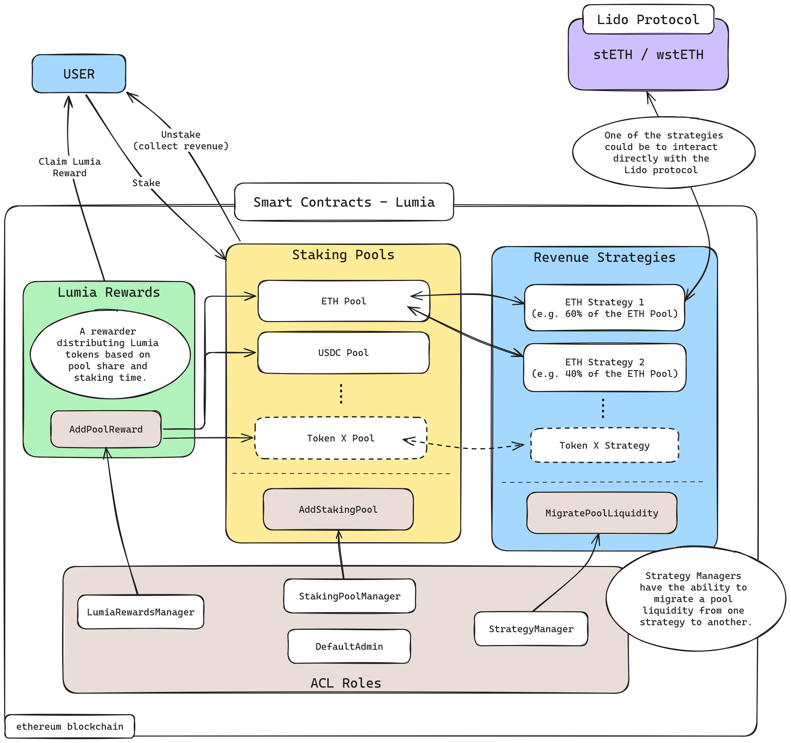

# Lumia Smart Contracts

---

This specification proposal outlines the initial phase of development, focusing on staking, reward distribution, and revenue generation strategies. The contracts will be deployed on the ethereum blockchain and will utilize a Diamond Proxy architecture to allow modularity and upgradability.

## 0. Diamond Proxy Architecture

Lumia smart contracts will be developed using the [Diamond Proxy pattern](https://eips.ethereum.org/EIPS/eip-2535):

- **Modularity and Upgradability:** This architecture will allow for flexible upgrades and the addition of new functionalities without disrupting existing operations, ensuring the protocol remains adaptable.

### Access Control List (ACL)

The **Access Control List (ACL)** in Lumia Smart Contracts defines roles like `LumiaRewardsManager`, `StakingPoolManager`, and `StrategyManager`, each with specific permissions to manage different parts of the protocol. The **DefaultAdmin** role holds the authority to assign and revoke these roles, ensuring controlled access to critical functions.

## 1. Lumia Rewards

Lumia will implement a rewards system to incentivize staking participants:

- **Token Airdrops:** Stakers will receive Lumia tokens as airdrops. The distribution will be based on each staker's share in the pool and the duration of their staking period.

- **Reward Distribution:** The reward distribution mechanism will use a method similar to Synthetix's staking rewards model (as detailed in the [video series](https://www.youtube.com/watch?v=6ZO5aYg1GI8)), customized to fit the specific needs of the Lumia project. This approach boils down to calculating `rewardPerSecond`, dynamically adjusting based on the total stake in the pool at any given time.

The addPoolReward function, which adds rewards to a staking pool, will have Restricted Access. Only the LumiaRewardsManager ACL role will be allowed to use this function to ensure controlled management of rewards and prevent unauthorized changes. Additionally, the rewards will have properties such as a start and end time, allowing them to be defined in advance before they begin.

## 2. Staking Pools

The Lumia protocol will feature multiple staking pools, initially focusing on an ETH staking pool:

- **ETH Pool:** The protocol will enable users to stake ETH into a dedicated ETH pool. This pool will allow participants to earn rewards both in Ethereum and Lumia (Lumia Rewards) tokens.

- **Multi-Strategy Connectivity:** Each staking pool can be connected to multiple strategies simultaneously, but there will only be one pool per token. To achieve this, tokens staked in the pool can be allocated and unlocked from various strategies as needed. Consequently, what users hold is more akin to a share of the pool, rather than direct control over the strategies themselves. This design allows for dynamic management of assets within the pool, optimizing returns by leveraging multiple strategies without direct user intervention in strategy management.

- **Expansion to Additional Pools:** The protocol will support the addition of new staking pools for different tokens, providing opportunities to expand the ecosystem and accommodate various assets. The creation of new staking pools will be managed through the `AddStakingPool` functionality, which is restricted to the `StakingPoolManager` ACL role. This restriction ensures that only authorized roles can add and configure new staking pools.

## 3. Revenue Strategies

Lumia will employ dynamic, low-risk strategies to generate optimal income for stakers. Instead of directly interacting with external protocols, such as Lido, for each individual stake—which is suboptimal—the protocol will enable more efficient management of pooled assets.

### Dynamic Strategy Management

The `StrategyManager` ACL role will have the ability to move pool liquidity dynamically across different strategies to maximize returns for users. Since a user's initial stake represents a share in the pool, their allocation can be spread across multiple strategies to optimize yield.

- **Strategy Interface:** Each strategy will implement a standardized Solidity interface, ensuring compatibility with the staking pools. This interface will require strategies to have the following functions:
  - **`allocate`**: This function allocates a specified amount of liquidity from the staking pool to the strategy.
  - **`exit`**: This function withdraws a specified amount of liquidity from the strategy back to the staking pool.

- **Liquidity Migration:** The `StrategyManager` will have access to the `MigratePoolLiquidity` function, which allows for the reallocation of liquidity between strategies. This function will perform an `exit` of a certain amount of liquidity from one strategy and an `allocate` to another, enabling dynamic adjustments based on market conditions and optimizing user returns.

- **APR Calculation:** Each strategy will also provide data necessary for calculating the Annual Percentage Rate (APR).

### Example Strategy: Reserve-Based Strategy

One example of a strategy is a **reserve-based strategy** focused on yield generation through the Lido Protocol. This reserve is managed to ensure sufficient liquidity for staking and unstaking operations. When users stake ETH, the strategy allocates a portion of the available stETH from the reserve to this user, allowing them to benefit from staking rewards generated by Lido.

When users exit, the strategy provides the user with their initial ETH plus the generated income from Lido, ensuring smooth exits without interacting with external protocols for each individual transaction. This approach minimizes transaction costs and optimizes the use of liquidity within the pool.

However, this solution has its limitations. It may occur that the strategy does not have full ETH coverage at a given time. In such cases, the user will still be able to perform a partial unstake. Additionally, the user does not lose their accrued revenue, as it is securely tracked within the contract, ensuring they can claim their rewards once the reserve is replenished.

### Example Strategy: Multi-Asset Reserve-Based Strategy

In addition to single-asset strategies, Lumia can implement a multi-asset reserve-based strategy to optimize staking rewards across various tokens. This strategy pools together a basket of assets, each with its own yield-generation potential, to create a more diversified and resilient reserve, thus mitigating the risk of relying on a single asset for returns.

- **Diverse Staking Assets:** The reserve can include multiple tokens from various staking platforms (e.g., stETH, rETH), each providing exposure to different staking rewards. By pooling these assets, the system can generalize various reserve-based strategies, offering exposure to multiple tokens without requiring additional logic or direct interaction with external protocols.

- **Dynamic Allocation:** The `StrategyManager` dynamically allocates and rebalances liquidity between these tokens based on performance and market conditions, easily shifting liquidity across underlying tokens to maximize returns.

- **Exit:* When users want to withdraw their stake, they receive a proportional share of the underlying token assets (e.g., a mix of stETH, rETH). If full liquidity is not available, partial withdrawals are supported, allowing users to claim the remaining portion later when liquidity is restored.

---

#TODO
- StrategyManager sets % golas for assets
- LidoProtocol integration
- Uniswap integration

---
