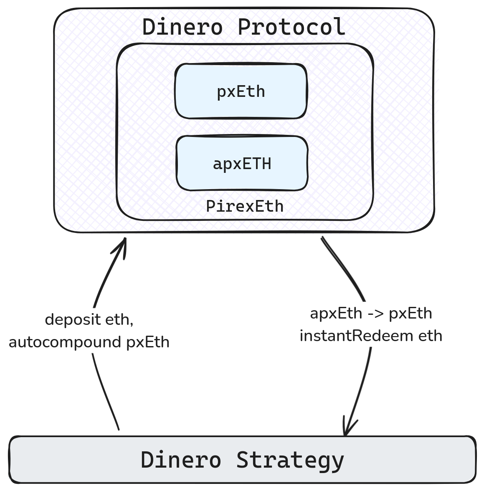

# Lumia Smart Contracts

---

This specification describes the architecture and key features of the Lumia Smart Contracts, which manage staking pools, cross-chain asset handling, and contract upgrades. The system uses two Diamond Proxy contracts: one on Ethereum for managing staking and strategies, and another on the Lumia Chain for interchain communication and asset revenue collection.

<p align="center">
    
</p>

## 0. Diamond Proxy Architecture

Lumia smart contracts will be developed using the [Diamond Proxy pattern](https://eips.ethereum.org/EIPS/eip-2535):

- **Modularity and Upgradeability**: The architecture supports adding or replacing functionalities without affecting ongoing operations, ensuring flexible contract modularity.

- **Second Diamond Proxy on Lumia Chain**: The secondary Diamond Proxy operates on the Lumia Chain to manage cross-chain asset handling and revenue collection. It facilitates hyperlane interchain messaging and ensures liquid LP tokens represent assets and revenues collected from other chains.

### Access Control List (ACL)

The **Access Control List (ACL)** defines roles like `StakingPoolManager`, and `StrategyManager`, each with specific permissions to manage different parts of the protocol. The **DefaultAdmin** role holds the authority to assign and revoke these roles, ensuring controlled access to critical functions. Additionally, the **DefaultAdmin** role is also responsible for managing **proxy upgrades**, allowing it to add, replace and delete specific contracts functionality.

### Hyperlane Integration

Hyperlane plays a crucial role in facilitating cross-chain communication and managing `LP tokens` within Hyperstaking. The integration is based on a `two-tier` system that supports both traditional and liquid staking operations:

- **Tier 1**: The primary tier, typically deployed on a chain like Ethereum. It maintains the base infrastructure for traditional staking. Users stake assets, and their staking information is stored in the contracts storage, along with the share in associated strategies. While no liquid LP tokens are issued in this tier, a small revenue fee is collected to benefit Tier 2 users, incentivizing cross-chain functionality.

- **Tier 2**: Deployed on the Lumia Chain, this tier manages liquid staking. When users stake assets, an interchain message is sent to mint a liquid LP token on the Lumia Chain, representing the revenue-generating assets linked to the strategy. These tokens are fully transferable, tradeable, and can be redeemed back to the originating chain. This architecture enables the Lumia Chain to collect revenue from assets on other chains. Simultaneously, it maintains liquid LP tokens that represent these assets locally. The Tier 2 system ensures efficient interchain messaging, leveraging Hyperlane's robust bridging capabilities.

Through this setup, users benefit from multi-chain revenue streams without the complexity of interacting with multiple protocols and bridges directly.

<div style="page-break-after: always;"></div>

## 1. Staking Pools

The Lumia protocol features multiple staking pools, allowing tokens like ETH to be staked across different pools. Each pool operates independently, even for the same asset.

- **Staking Pools**: Both native assets (e.g., ETH) and tokens can be staked in multiple pools, each operating independently and linked to different strategies. This setup allows for greater flexibility in managing staking operations across a variety of assets.

- **Pool Identification**: Each staking pool is assigned a unique `poolId`, generated using the following Solidity function:

<div class="avoid-break">
```solidity
function generatePoolId(address stakeToken, uint96 idx) public pure returns (uint256) {
  return uint256(keccak256(
      abi.encodePacked(
          stakeToken,
          idx
      )
  ));
}
```
</div>

  The `poolId` is based on the token's address and an index (`idx`), which represents the pool number for that asset. This ensures unique identification for each pool and provides an efficient way to manage contract storage. The `generatePoolId` function is publicly available for external systems to calculate the `poolId` as needed.

- **Strategy Assignment:** Each staking pool is assigned a strategy at creation. Only one instance of a strategy is connected to a pool, and the system validates that a strategy is not already assigned to another pool, preventing contract storage collisions

- **Staking Operations:** Since multiple pools can exist for the same token, users are required to choose which pool and strategy to use when staking. Users interact with the staking pools through the `stakeDeposit` and `stakeWithdraw` functions.

- **Adding New Pools:** New staking pools are added using the `AddStakingPool` function, which is restricted to the `StakingPoolManager` ACL role, ensuring that only authorized entities can create and configure new pools.

## 2. Revenue Strategies

Low-risk strategies are used to generate optimal income for stakers. All strategies implement a common interface, enabling seamless integration with staking pools and allowing new strategies to be added over time. The interface is defined in the [IStrategy.sol](../../contracts/hyperstaking/interfaces/IStrategy.sol) contract and includes the following key functions:

```solidity
    /**
     * @notice Allocates a specified amount of the stake to the strategy
     * @param stakeAmount_ The amount of stake received for allocation
     * @param user_ The address of the user making the allocation
     * @return allocation The amount successfully allocated
     */
    function allocate(
        uint256 stakeAmount_,
        address user_
    ) external payable returns (uint256 allocation);

    /**
     * @notice Exits a specified amount of the strategy shares to the vault
     * @param assetAllocation_ The amount of the strategy-specific asset (shares) to withdraw
     * @param user_ The address of the user requesting the exit
     * @return exitAmount The amount successfully exited
     */
    function exit(uint256 assetAllocation_, address user_) external returns (uint256 exitAmount);
```

This interface allows strategies to be deployed independently of the main upgradeable Proxy Diamond code and linked with new staking pools.

- **Shares:** Are emitted by the strategies and moved to the `StrategyVault`. These shares represent the user’s contribution in the strategy, (vault may potentially issue derivative tradable liquidity tokens). Specific strategies examples are detailed below.

<div style="page-break-after: always;"></div>

### Example Strategy: Reserve-Based Strategy

One example of a strategy is a **reserve-based strategy** focused on yield generation through a specific defined asset (e.g., stETH from the Lido Protocol). This reserve is managed to ensure sufficient liquidity for staking and unstaking operations. When users stake ETH, the strategy allocates a portion of the available wstETH from the reserve to the user, allowing them to benefit from staking rewards generated by Lido.

<p align="center">

</p>

When users exit, the strategy returns their initial ETH plus the generated income, ensuring smooth exits without needing to interact with external protocols for each individual transaction. This approach minimizes transaction costs and optimizes the use of liquidity within the pool.

However, this solution has its limitations. It’s possible that the strategy may not have full ETH coverage at certain times. In such cases, the user will still be able to perform a partial unstake. Additionally, the user will not lose any accrued revenue, as it is tracked within the contract, allowing them to claim their rewards once the reserve is replenished.

A simplified version of this strategy has been implemented and is currently being used for testing purposes.

### Example Strategy: Dinero Protocol Integration

Another example strategy is the [**Dinero Protocol**](https://dinero.xyz/) **Integration**, focused on yield generation through the **apxETH** token, emitted by the `PirexETH` contract from the Dinero Protocol. The strategy auto-compounds pxETH into apxETH to maximize returns, generating around 8% APY, and is stored in the Lumia `StrategyVault`.

<p align="center">

</p>

When users stake ETH, the strategy interacts directly with the Dinero Protocol, converting ETH into pxETH, which is then auto-compounded into apxETH. This allows users to benefit from the compounding returns offered by the Dinero Protocol.

When users unstake, the Dinero Protocol is used to redeem pxETH from apxETH (an ERC-4626 vault). pxETH is then converted to ETH for withdrawal, plus accumulated interest, with a 0.5% fee applied.

In the future, the fee could be reduced by implementing a delayed unstake option, creating an unstake buffer for ongoing operations, similar to the model used in the Dinero Protocol.

