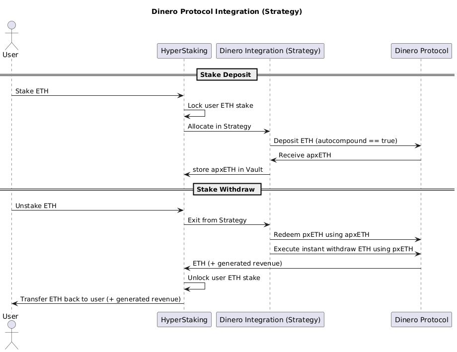
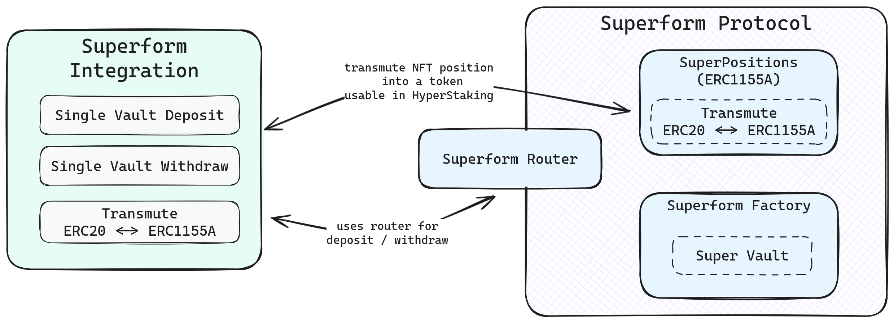
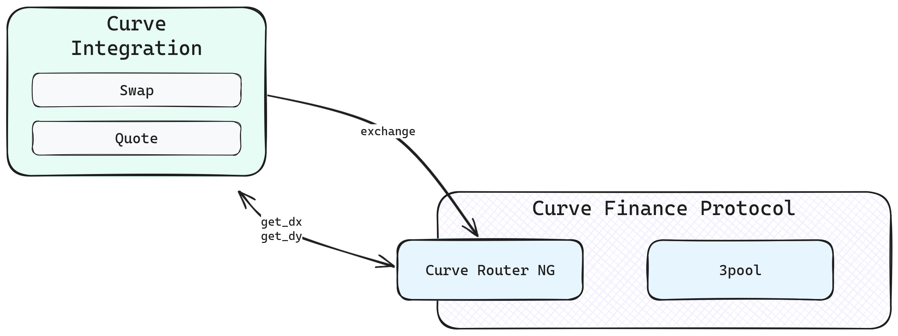

# Lumia Smart Contracts (HyperStaking)

---

This specification describes the architecture and key features of the **Lumia Smart Contracts**, which manage staking pools, cross-chain asset handling, and contract upgrades.

---

## 0. Diamond Proxy Architecture

**HyperStaking** is built using the [**Diamond Proxy pattern**](https://eips.ethereum.org/EIPS/eip-2535), providing modularity and upgradeability by separating functionality into dedicated facets that can be added, replaced, or removed without interrupting operations.

* **Origin-Chain Diamond Proxy**
  Deployed on origin chains such as Ethereum, Base, or Arbitrum, it handles user deposits, allocations, exits, and strategy execution.
  It includes operational facets like **Deposit**, **Allocation**, and **Lockbox**, which coordinate staking flows and communicate with external yield strategies.

* **Lumia-Chain Diamond Proxy**
  Deployed on the **Lumia Chain**, it manages cross-chain communication, vault accounting, and reward distribution.
  It receives Hyperlane messages from origin chains, mints and burns **ERC4626** vault shares, and ensures consistent representation of users’ stakes and rewards across chains.

Together, these proxies form a synchronized multi-chain system where the **origin-chain diamonds** handle local operations, while the **Lumia diamond** maintains unified accounting and coordination.

---

## 1. HyperStaking

The following sections describe how the HyperStaking system operates across its main functional layers.
They detail the flow of assets and information within the **origin-chain Diamond Proxy** and its coordination with the **Lumia Chain**, covering:

* **Deposit Flow** – how user funds enter the system and are routed to strategies or vaults,
* **Allocation Flow** – how deposits are processed, allocated, and reported by individual strategies, and
* **Cross-Chain Flow** – how stake, rewards, and redemptions are synchronized between origin chains and the Lumia Chain through **Hyperlane** messaging.

Together, these flows illustrate how HyperStaking unifies multi-chain deposits, asynchronous strategy operations, and cross-chain accounting into a single coordinated protocol.

### 1.1 Deposit Flow

<p align="center">
    
</p>

The diagram illustrates how staking requests move through the HyperStaking Diamond Proxy from a user’s perspective.
Users initiate deposits through the **Deposit Facet**, which routes incoming assets, either native tokens or ERC20s to the appropriate staking currency pool represented by the chosen strategy.

Depending on the configuration, deposits may represent **direct stakes** (bypassing strategies) or **strategy-based allocations** in external protocols handled by the **Allocation Facet**.

All stake and withdrawal operations pass through the **Lockbox Facet**, where allocations are locked and cross-chain operations, including coordination with the **Lumia Chain**, are managed.

<div style="page-break-after: always;"></div>

---

#### Handling Multiple Deposit Currencies

The HyperStaking protocol supports staking with a variety of asset types, including both native tokens (e.g., **ETH**) and ERC20 tokens.
Some strategies, such as **Superform**, can even handle wrapped representations of other assets, including NFTs, enabling a broad range of staking options under a single framework.

Asset types are standardized through the `Currency` struct, which distinguishes native coins from ERC20 tokens:

```solidity
/**
 * @notice Represents a supported asset type.
 * @dev If `token` is address(0), it refers to the chain’s native coin (e.g., ETH).
 */
struct Currency {
    address token;
}
```

Each strategy defines which currencies it supports, allowing for flexible configuration across chains and protocols.
Despite this flexibility, deposits and withdrawals share a unified interface, ensuring consistent behavior regardless of whether the underlying asset is native, tokenized, or wrapped.

---

#### Access Control List (ACL)

The **Access Control List (ACL)** defines roles like `StakingManager`, and `VaultManager`, each with specific permissions to manage different parts of the protocol. The **DefaultAdmin** role holds the authority to assign and revoke these roles, ensuring controlled access to critical functions. Additionally, the **DefaultAdmin** role is also responsible for managing **proxy upgrades**, allowing it to add, replace and delete specific contract functionality.

---

### 1.2 Allocation Flow

<p align="center">
    
</p>

The **Allocation Facet** manages strategy interactions such as `join`, `leave`, and `report`, coordinating asynchronous operations defined by the **IStrategy** interface (`requestAllocation`, `claimAllocation`, `requestExit`, `claimExit`).
Each strategy, such as **Dinero**, **Superform**, or **Gauntlet**, implements this unified interface, ensuring consistent behavior across all yield sources.

The `report()` function triggers protocol-fee collection, compounds the stake, and sends a cross-chain message to distribute rewards to current shareholders. Protocol fees are applied only to generated revenue, not to users’ base stakes.

Dedicated integration facets, such as the **Superform Integration Facet** and **Curve Integration Facet**, enable direct interaction with external protocols for advanced yield generation and asset exchange.

All accounting and reward synchronization are finalized through the **Lockbox Facet**, which manages cross-chain coordination with the **Lumia Chain**.

<div style="page-break-after: always;"></div>

---

#### Hyperlane Integration

**Hyperlane** provides secure cross-chain messaging between origin-chain Diamond Proxies and the central Lumia Chain Diamond Proxy. This ensures:

- **Direct Staking**: Direct staking allows users to stake assets directly on the Lumia Chain without needing to pass through the revenue strategy. This enables faster processing and more flexible staking options, while still maintaining cross-chain compatibility through Hyperlane's messaging infrastructure.

- **Stake Synchronization**: When a user stakes on an origin chain, a Hyperlane message is sent to mint ERC4626 shares on the Lumia Chain representing the stake plus accrued revenue.

- **Redemption Flow**: When a user redeems or exits shares on the Lumia Chain, Hyperlane relays a burn-and-withdraw instruction to the origin-chain proxy to burn the shares and release the underlying assets and rewards.

This design centralizes staking and redemption logic around Hyperlane messaging, enabling users to seamlessly access multi-chain revenue streams without interacting directly with multiple protocols or bridges.

---

### 1.3 Cross-Chain Flow

<p align="center">
    
</p>

The **Cross-Chain Flow** diagram illustrates how staking, rewards, and redemptions move between origin chains (e.g., Ethereum) and the **Lumia Chain**, using **Hyperlane** as the underlying bridge.

On the origin chain, user stakes and allocations are managed by the **Lockbox Facet**, which communicates with the Lumia side through Hyperlane mailboxes. When a new strategy or stake event occurs, the Lockbox sends structured messages such as `StakeInfo`, `StakeReward`, or `StakeRedeem` across the **Hyperlane Bridge**.

On the Lumia Chain, the **Lumia Diamond Proxy** receives and processes these messages via the **Hyperlane Handler**, delegating logic to the **RWA Facet** and other components that handle minting, rewards, and redemptions. The **Lumia Vault**, implemented as an **ERC4626** contract (e.g., *Lumia SuperUSDC*), issues or burns vault shares. The underlying **Principal Token**, used as the vault asset, represents the user’s stake.

Throughout the entire hyper-staking process, the same wallet address can represent both the user and the shareholder, maintaining a unified identity across chains.

<div style="page-break-after: always;"></div>

## 2. Revenue Strategies

Strategies define how user stake is deployed into revenue-generating assets or held in compatible forms.
Each strategy conforms to a standard interface that supports both **synchronous** and
**asynchronous** operations, allowing seamless integration with vaults and staking pools while remaining decoupled from the core diamond proxy logic. New strategies can be added without affecting the other ones.

The protocol uses a **two-step request model**:

* **Request**: a deposit or redemption is enqueued as a `StrategyRequest`, with an assigned
  `readyAt` timestamp.
* **Claim**: once `readyAt` is reached (or immediately if `readyAt == 0`), the request can be
  claimed, finalizing the allocation or exit.

Each request across all strategies is assigned a **globally unique ID** generated by the
HyperStaking core, ensuring deterministic tracking and preventing collisions between different
strategies.

---

### 2.1 Core Interface: Allocation & Exit

The strategy interface defines four core async functions:

```solidity
function requestAllocation(uint256 requestId_, uint256 stakeAmount_, address user_)
    external
    payable
    returns (uint64 readyAt);

function claimAllocation(uint256[] calldata ids_, address receiver_)
    external
    returns (uint256 totalAssetAllocation);

function requestExit(uint256 requestId_, uint256 assetAllocation_, address user_)
    external
    returns (uint64 readyAt);

function claimExit(uint256[] calldata ids_, address receiver_)
    external
    returns (uint256 totalExitStakeAmount);
```

* **`requestAllocation`**
  Creates a new deposit request for staking assets. Returns the earliest time when the request can
  be claimed (`readyAt`).
  If `readyAt == 0`, the request can be claimed immediately.

* **`claimAllocation`**
  Finalizes one or more allocation requests. Depending on the strategy, this may mint shares, credit
  internal balances, or forward assets received from an external protocol to the `receiver_`.

* **`requestExit`**
  Creates a redemption request to convert strategy shares back into stake currency.
  Returns the earliest time the exit can be claimed.

* **`claimExit`**
  Finalizes one or more exit requests, returning redeemed stake to the `receiver_`.

These functions allow the vault to treat all strategies uniformly, regardless of the underlying protocol or mechanics.

---

### 2.2 StrategyRequest

All requests share a common format:

```solidity
struct StrategyRequest {
    address user;       // User associated with the request
    StrategyKind kind;  // Allocation or Exit
    bool claimed;       // Set true once claimed
    uint256 amount;     // Stake for allocation; shares for exit
    uint64 readyAt;     // Earliest claim timestamp (0 = now)
}
```

Requests can be queried via `requestInfo(id)` or `requestInfoBatch(ids)` to track status, including
whether they are claimable or already claimed.

<div style="page-break-after: always;"></div>

### 2.3 Strategy Type Flags

To support different flow patterns, each strategy also exposes two boolean flags:

```solidity
    /**
     * @notice Indicates whether the strategy is a DirectStakeStrategy.
     * @dev  Direct stake strategies bypass yield‑generating logic and
     *       exist solely to allow 1:1 deposits into the vault. They:
     *         - Store currency info for compatibility with the vault.
     *         - Revert on any `allocate`, `exit`, or preview calls.
     *         - Perform no token or native transfers.
     * @return Always `true` for direct stake strategies, `false` otherwise.
     */
    function isDirectStakeStrategy() external view returns (bool);

    /**
     * @notice Returns true if this stake strategy is an integrated strategy.
     * @dev  Integrated strategies delegate all asset movements to the
     *       IntegrationFacet within the same diamond. As a result:
     *         - No calls to `transferFrom` or native pull operations.
     *         - No ERC20 approvals managed by the strategy itself.
     *         - `allocate(...)` and `exit(...)` simply forward to the facet,
     *           which executes internal transfers between strategy and vault.
     * @return Always `true` for integrated strategies, `false` otherwise.
     */
    function isIntegratedStakeStrategy() external view returns (bool);
```

* **Direct strategies** are effectively placeholders: they exist to satisfy the vault’s strategy interface without moving funds into any external protocol. Perfect for simple 1:1 deposit/withdraw flows.
* **Integrated strategies** rely on the diamond’s IntegrationFacet to handle every asset movement internally. No external allowance setup or approval calls are needed; the facet’s permission covers both ERC20 and native transfers.

This separation of allocation/exit logic from strategy‑type flags ensures clarity: the vault always calls `allocate` and `exit` in the same way, while each strategy declares its operational mode via its flags.

* **Shares:** Are minted on the Lumia Chain as ERC4626 tokens, representing users’ stake within a strategy and used to distribute revenue generated by that strategy.

---

## Reward Distribution via `report()` (Allocation Facet)

The `report()` function, implemented in the **Allocation Facet**, serves as the central mechanism for yield aggregation and reward synchronization across chains.
It updates accounting for a given strategy, compounds revenue, applies protocol fees, and broadcasts results to the Lumia Chain via **Hyperlane** messaging.

```solidity
/**
 * @notice Harvests and compounds revenue for a given strategy.
 * @dev Restricted by ACL to authorized managers.
 */
function report(address strategy) external;
```

**Flow**

1. **Trigger**: An authorized manager (or automation service) calls `report(strategy)` for a specific strategy.
2. **Accounting**: The function evaluates the current asset balance of the strategy, calculates accumulated yield since the last report, and updates internal totals, effectively increasing `totalAssets` and recalculating `pricePerShare = totalAssets / totalShares`.
3. **Protocol Fee**: A protocol fee is applied to generated revenue.
4. **Cross-Chain Distribution**: The contract emits a `RewardsReported(amount)` event and sends a Hyperlane message to the Lumia Chain, where vault share prices are updated to reflect the new yield.
5. **User Update**: The updated share price automatically increases the value of users’ holdings, so yield is realized passively without requiring manual claims or restakes.

This mechanism keeps strategies lightweight and asynchronous while ensuring consistent, cross-chain reward reflection for all shareholders.

<div style="page-break-after: always;"></div>


## Strategy Integration Examples

---

### Reserve-Based Strategy

One example of a strategy is a **reserve-based strategy** focused on yield generation through a specific defined asset (e.g., stETH from the Lido Protocol). This reserve is managed to ensure sufficient liquidity for staking and unstaking operations. When users stake ETH, the strategy allocates a portion of the available wstETH from the reserve to the user, allowing them to benefit from staking rewards generated by Lido.

<p align="center">

</p>

When users exit, the strategy returns their initial ETH plus the generated income, ensuring smooth exits without needing to interact with external protocols for each individual transaction. This approach minimizes transaction costs and optimizes the use of liquidity within the pool.

However, this solution has its limitations. It’s possible that the strategy may not have full ETH coverage at certain times. In such cases, the user will still be able to perform a partial unstake. Additionally, the user will not lose any accrued revenue, as it is tracked within the contract, allowing them to claim their rewards once the reserve is replenished.

A simplified version of this strategy has been implemented and is currently being used only as a testing mock.

---

### Dinero Protocol Integration

Another example strategy is the [**Dinero Protocol**](https://dinero.xyz/) **Integration**, focused on yield generation through the **apxETH** token, emitted by the `PirexETH` contract from the Dinero Protocol. The strategy auto-compounds pxETH into apxETH to maximize returns, generating around 8% APY, and is stored in the Lumia `StrategyVault`.


<p align="center">

</p>

When users stake ETH, the strategy interacts directly with the Dinero Protocol, converting ETH into pxETH, which is then auto-compounded into apxETH. This allows users to benefit from the compounding returns offered by the Dinero Protocol.

When users unstake, the Dinero Protocol is used to redeem pxETH from apxETH (an ERC4626 vault). pxETH is then converted to ETH for withdrawal, plus accumulated interest, with a 0.5% fee applied.

<p align="center">

</p>

---

### Superform Strategy

<p align="center">

</p>

The Superform Strategy is an **integrated** strategy that interacts with its dedicated `SuperformIntegrationFacet` within the diamond. On allocation, it:

1. Receives USDC deposits via the `allocate` call.
2. Queries the Superform protocol’s on‑chain for the current USDC -> SuperUSDC conversion rate, which reflects accrued interest and floating rates.
3. Calculates the exact amount of SuperUSDC to mint.
4. Invokes the `SuperformIntegrationFacet` to perform the internal transfer: moving USDC out of the allocation vault and minting SuperUSDC directly by the protocol.

On exit:

1. The strategy calculates the redeemable USDC amount from SuperUSDC using the latest rate.
2. Calls the `SuperformIntegrationFacet` to transmute ERC20 SuperUSDC back into its ERC1155 NFT representation.
3. Invokes the `SuperformIntegrationFacet` to burn the ERC1155 SuperUSDC and credit the corresponding USDC back to the user.
4. All transfers remain within the diamond, leveraging its internal asset registry and permissioning.

This approach ensures:

* Tight integration with Superform’s yield accrual.
* Zero on‑chain approval overhead.
* Accurate valuation via on‑chain rate feeds.

<div style="page-break-after: always;"></div>

### Swap Super Strategy

<p align="center">

</p>

The Swap Super Strategy is also **integrated** and uses two dedicated facets—`CurveIntegrationFacet` and `SuperformIntegrationFacet` to orchestrate a two‑step flow:

1. **USDT -> USDC (Curve 3pool):** Uses Curve’s large, highly liquid 3pool to swap incoming USDT for USDC in a single step, executed internally via `CurveIntegrationFacet`.

2. **USDC -> SuperUSDC (Superform):** Forwards the obtained USDC to `SuperformIntegrationFacet`, which mints SuperUSDC as in the Superform Strategy.

On exit, the strategy reverses these steps:

1. Burns SuperUSDC via the Superform facet to receive USDC.
2. Swaps USDC back to USDT using the Curve 3pool facet’s optimal path logic.
3. Returns USDT to the user, all through internal facet calls.

By combining Curve’s efficient pool mechanics with Superform’s yield‑boosting wrapper, the Swap Super Strategy offers a seamless entry from USDT into interest‑bearing SuperUSDC and exit back to USDT, **fully integrated** within the diamond’s logic and asset management framework.

---

### Gauntlet gtUSDa (Aera Protocol Integration)

The **Gauntlet Strategy** integrates with the [**Aera Protocol**](https://aera.finance/) to generate yield through the **gtUSDa** asset — a yield-bearing stablecoin designed to maintain capital efficiency while earning returns from multiple liquidity sources.

When users stake USDC, the strategy allocates the deposit to Aera’s `MultiDepositorVault`, which mints **gtUSDa** tokens representing the user’s proportional share of the underlying yield-bearing assets.
Internally, a wrapped version of this token, **LumiaGtUSDa**, is used within the HyperStaking system to ensure consistent accounting. The **Aera Protocol** manages yield generation and collateral composition for gtUSDa through governed vault strategies, maintaining stable value and steady returns.

On exit, the strategy unwraps **LumiaGtUSDa** and redeems **gtUSDa** back into USDC through Aera’s vault. Any pending redemptions are handled asynchronously through the standard `requestExit` and `claimExit` flows.

